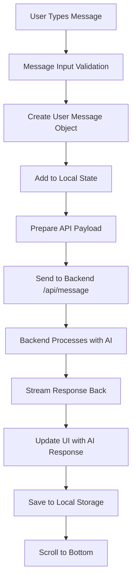
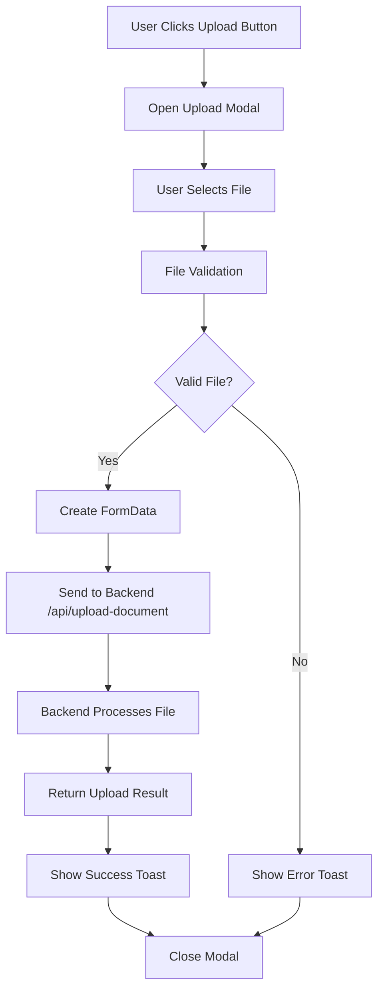
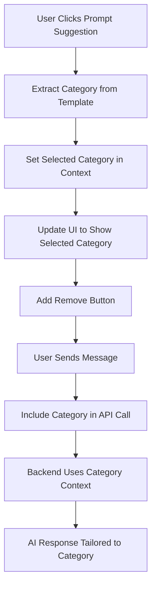
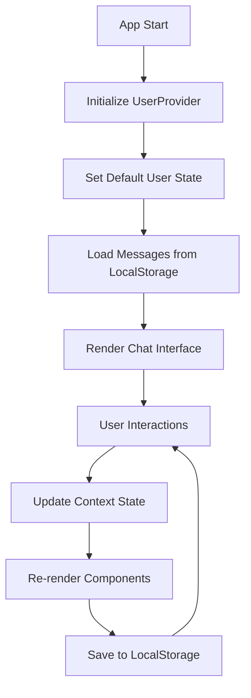

# ZorifBot Frontend

A modern, responsive React-based chatbot interface built with Create React App, featuring AI-powered conversations, document uploads, and intelligent prompt suggestions.

## 🚀 Features

### Core Functionality
- **AI Chat Interface** - Real-time conversations with AI models
- **Document Upload** - Upload and process PDF, TXT, DOC, DOCX files
- **Prompt Suggestions** - Pre-built templates organized by categories
- **Category Selection** - Single category selection with context-aware responses
- **Dark/Light Mode** - Toggle between themes
- **Model Selection** - Choose between different AI models (DeepSeek, Phi4)
- **Chat History** - Persistent local storage with export functionality
- **Prompt Enhancement** - Auto-enhance prompts for better AI responses

### User Experience
- **Responsive Design** - Works on desktop, tablet, and mobile
- **Real-time Streaming** - Live AI response streaming
- **Drag & Drop Upload** - Intuitive file upload interface
- **Toast Notifications** - User feedback for all actions
- **Loading States** - Visual feedback during operations

## 🏗️ Architecture

### Technology Stack
- **Framework**: React 18 with Create React App
- **Language**: JavaScript (ES6+)
- **Styling**: Tailwind CSS
- **State Management**: React Context API
- **Routing**: Wouter (lightweight router)
- **HTTP Client**: Fetch API with React Query
- **UI Components**: Custom components with Radix UI primitives
- **Icons**: Lucide React
- **Date Handling**: date-fns
- **Markdown**: react-markdown

### Project Structure
```
cra-client/
├── public/
├── src/
│   ├── components/
│   │   ├── chat/
│   │   │   ├── ChatArea.js          # Main chat interface
│   │   │   ├── ChatHeader.js        # Chat header with controls
│   │   │   ├── ChatSidebar.js       # Prompt suggestions sidebar
│   │   │   ├── MessageBubble.js     # Individual message display
│   │   │   ├── MessageInput.js      # Message input field
│   │   │   └── PromptSuggestion.js  # Individual prompt template
│   │   ├── upload/
│   │   │   └── UploadModal.js       # Document upload modal
│   │   └── ui/                      # Reusable UI components
│   ├── hooks/
│   │   ├── use-mobile.js           # Mobile detection hook
│   │   └── use-toast.js            # Toast notification hook
│   ├── lib/
│   │   ├── customPrompts.js        # Static prompt templates
│   │   ├── queryClient.js          # API client configuration
│   │   ├── userContext.js          # Global user state management
│   │   └── utils.js                # Utility functions
│   ├── pages/
│   │   ├── chat.js                 # Main chat page
│   │   └── not-found.js            # 404 page
│   ├── App.js                      # Root component
│   ├── index.js                    # Application entry point
│   └── index.css                   # Global styles
├── package.json
├── tailwind.config.js
└── README.md
```

## 🔄 Application Flow

### 1. Chat Message Flow


### 2. Document Upload Flow


### 3. Category Selection Flow


### 4. State Management Flow


## 🎯 Key Components

### ChatArea.js
**Purpose**: Main chat interface orchestrator
**Key Features**:
- Manages message state and API calls
- Handles streaming responses
- Coordinates with user context
- Manages chat history persistence

**State Management**:
```javascript
const [messages, setMessages] = useState(loadMessages());
const [isLoading, setIsLoading] = useState(false);
const [selectedModel, setSelectedModel] = useState("phi4");
const [darkMode, setDarkMode] = useState(false);
```

### UserContext.js
**Purpose**: Global state management for user data
**Key Features**:
- User ID management
- Category selection state
- User preferences
- Context providers for child components

**Context Structure**:
```javascript
{
  user: {
    id: 'default-user-123',
    name: 'Test User',
    preferences: {
      selectedCategory: null,
      modelPreference: 'phi4'
    }
  },
  setSelectedCategory,
  removeSelectedCategory,
  updateUserPreferences
}
```

### UploadModal.js
**Purpose**: Document upload interface
**Key Features**:
- Drag & drop file selection
- File validation (type, size)
- Upload progress indication
- Error handling and user feedback

**Supported File Types**:
- PDF (.pdf)
- Text files (.txt)
- Word documents (.doc, .docx)
- Maximum size: 10MB

## 🔧 Configuration

### Environment Variables
Create a `.env` file in the root directory:
```env
REACT_APP_API_URL=http://localhost:5000
REACT_APP_DEFAULT_MODEL=phi4
```

### Tailwind CSS Configuration
The project uses a custom Tailwind configuration with:
- Custom color scheme
- Dark mode support
- Custom animations
- Responsive breakpoints

### API Configuration
The frontend communicates with the backend via:
- **Base URL**: `http://localhost:5000`
- **Endpoints**:
  - `POST /api/message` - Send chat messages
  - `POST /api/upload-document` - Upload documents
  - `GET /health` - Health check

## 🚀 Getting Started

### Prerequisites
- Node.js 16+ 
- npm or yarn
- Backend server running on port 5000

### Installation
```bash
# Clone the repository
git clone <repository-url>
cd cra-client

# Install dependencies
npm install

# Start development server
npm start
```

### Available Scripts
```bash
npm start          # Start development server
npm run build      # Build for production
npm test           # Run tests
npm run eject      # Eject from Create React App
```

## 📱 Responsive Design

### Breakpoints
- **Mobile**: < 768px
- **Tablet**: 768px - 1024px
- **Desktop**: > 1024px

### Mobile Features
- Collapsible sidebar
- Touch-friendly interface
- Optimized file upload
- Responsive message bubbles

## 🎨 UI/UX Features

### Theme System
- **Light Mode**: Clean, professional appearance
- **Dark Mode**: Reduced eye strain for low-light environments
- **Automatic Persistence**: Theme preference saved in localStorage

### Accessibility
- Keyboard navigation support
- Screen reader compatibility
- High contrast mode support
- Focus management

### Performance Optimizations
- Lazy loading of components
- Memoized callbacks
- Efficient re-renders
- Optimized bundle size

## 🔒 Security Features

### Input Validation
- Client-side validation for all user inputs
- File type and size validation
- XSS prevention in message content
- Sanitized markdown rendering

### API Security
- CORS configuration
- Credential inclusion
- Error handling without sensitive data exposure

## 🧪 Testing

### Manual Testing Checklist
- [ ] Chat message sending and receiving
- [ ] Document upload functionality
- [ ] Category selection and removal
- [ ] Dark/light mode toggle
- [ ] Model selection
- [ ] Chat history persistence
- [ ] Export functionality
- [ ] Responsive design on different screen sizes
- [ ] Error handling scenarios

### Browser Compatibility
- Chrome 90+
- Firefox 88+
- Safari 14+
- Edge 90+

## 🐛 Troubleshooting

### Common Issues

**1. API Connection Errors**
```bash
# Check if backend is running
curl http://localhost:5000/health

# Verify CORS configuration
# Check network tab in browser dev tools
```

**2. File Upload Issues**
- Ensure file size < 10MB
- Check file type is supported
- Verify backend upload endpoint is working

**3. State Persistence Issues**
- Clear localStorage: `localStorage.clear()`
- Check browser storage settings
- Verify user permissions

### Debug Mode
Enable debug logging by setting:
```javascript
localStorage.setItem('debug', 'true');
```

## 📈 Performance Metrics

### Bundle Analysis
- **Initial Bundle**: ~500KB
- **Lazy Loaded**: ~200KB
- **Total Size**: ~700KB

### Loading Times
- **First Contentful Paint**: < 1.5s
- **Time to Interactive**: < 2.5s
- **Largest Contentful Paint**: < 2s

## 🔄 Deployment

### Production Build
```bash
npm run build
```

### Deployment Options
- **Netlify**: Drag and drop `build` folder
- **Vercel**: Connect repository for automatic deployment
- **AWS S3**: Upload `build` folder to S3 bucket
- **Docker**: Use multi-stage build for containerization

### Environment Configuration
Set production environment variables:
```env
REACT_APP_API_URL=https://your-backend-domain.com
NODE_ENV=production
```

## 🤝 Contributing

### Development Workflow
1. Fork the repository
2. Create feature branch
3. Make changes with proper testing
4. Submit pull request
5. Code review and merge

### Code Style
- Use ESLint configuration
- Follow React best practices
- Write meaningful commit messages
- Include tests for new features

## 📄 License

This project is licensed under the MIT License - see the LICENSE file for details.

## 🆘 Support

For support and questions:
- Create an issue in the repository
- Check the troubleshooting section
- Review the backend documentation
- Contact the development team

---

**Version**: 1.0.0  
**Last Updated**: December 2024  
**Maintainer**: Development Team
